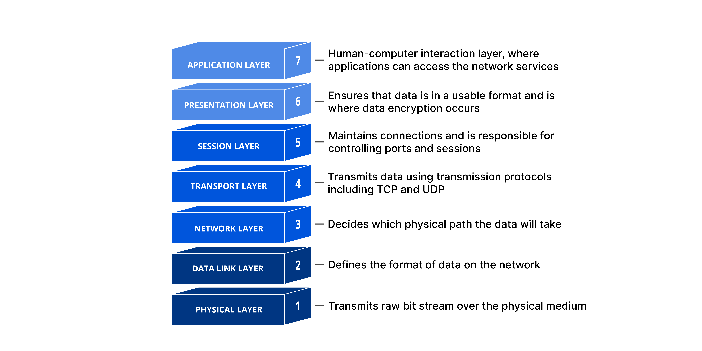

+++
# The "[Part 0]." prefix is deliberately NOT in the title: Blowfish's series
# widget renders each entry as "Part {series_order}: {title}", so keeping it
# here would read "Part 0: [Part 0]. Build your own...".
title = "Build your own web-server using Java and a bit of curiosity - Foundation"
date = "2026-07-21"
description = "My journey of building a web-server from scratch using Java 25."

# Kept as a draft: this post has never been deployed. Flip to false to publish.
# Note the deploy workflow only triggers on `main`, so pushing this branch
# publishes nothing either way.
draft = true

showTableOfContents = true

# Drives the "part of a series" widget. `series_order` is what the widget
# prints after "Part", so 0 here gives "Part 0: This Article" -- matching the
# post's own Part 0 framing. Later parts just need series_order = 1, 2, ...
#
# Multi-word names are safe: series_base.html looks the term up with
# strings.ToLower, and Hugo keys .Site.Taxonomies.series by the lowercased
# term (only the URL gets urlized, to /series/why-not-a-webserver/).
series = ["Why Not A Webserver"]
series_order = 0

keywords = [
    "Java",
    "IO",
    "sockets",
    "web server"
]
# `java` is deliberately not a tag: the category is already "Java", and both
# render as identical uppercase chips, so the card showed "JAVA JAVA".
tags = [
    "diy",
    "diy-webserver",
]
categories = [
    "Java"
]
+++
You may wonder why another web server, when there's already [Jetty](https://github.com/jetty/jetty.project), [Tomcat](https://github.com/apache/tomcat), [Netty](https://github.com/netty/netty) etc. 
My answer is [why not](https://github.com/gvart/why-not-webserver)? I'm genuinely bored with the current state of AI engineering, where the only thing you have to do is write another prompt 
to implement another boring ticket, read another paper which was mostly generated by AI, or join some corporate meeting where you start asking yourself existential questions. 
To entertain myself I decided to build a web-server capable of handling traffic via plain TCP and UDP, HTTP and WebSockets with a follow-up Spring Boot Starter and benchmarks (JMH and load tests). 

My final goal is not building a production-grade web-server - my goal is to learn things from A to Z, understand how things work at different levels of abstraction and definitely have some fun!


> [!IMPORTANT] Don't perceive this as a holy grail of web-server building
> This series of blog posts is more of private notes I've taken along the way to understand different topics and better memorize them. I thought other software enthusiasts might be interested in this, that's why
> I decided to share it on my personal blog.

## Why learn the basics?

Many of us know how to build a **static webpage**, **REST-API**, a **GraphQL-API**, realtime **communication via WebSocket** and so on using open source libraries and frameworks like Spring, Ktor, Quarkus etc.
The whole purpose of these top-level abstractions is to simplify your life as a developer, so you don't have to worry about the specs of different protocols and technologies, which helps you to focus on the business logic
and boost your productivity, on the other hand, you start forgetting how things actually work...

Do you really need to know that? In my opinion **no**, since I meet many senior engineers who have no idea what is happening
behind these magic annotations which they use every day to write production code not mentioning the low-level protocols and how data is actually being received by the server and sent back to the client, but this
doesn't make them bad engineers, this knowledge became obsolete in a way, and is not a requirement in many companies to write software.

Taking all this into consideration, why am I still writing? My answer is because **I'm curious**, I've always liked to deep dive into the open source code, debug it and sometimes fork it to modify certain parts which
were specific to my project. So to build our own web-server we must _debug_ the protocol to understand what is happening when you create a server socket, parse the request payload and respond to the client, why we have 7 OSI
levels, why they matter, and finally understand what is happening when you place that magical annotation on top of your method which exposes it as a REST endpoint, a static page or a WebSocket.

If your curiosity is the characteristic that motivated you to do your day-to-day job, then let's dive into this topic and start to learn and craft.


## Back to the roots - OSI Levels and how the connection works
The Open Systems Interconnection (OSI) model defines how computers communicate to each other across networks. To simplify how data is transmitted from computer A to computer B, it is split in 7 canonical layers:



I think it's always easier to understand a complex implementation by giving real-world examples, explaining the concepts and defining what is happening at each OSI level.
Let's imagine that you've built a REST API which allows end customers to manage their TODO list. The user is trying to create a new TODO item by invoking your creation endpoint (i.e. `POST: /api/v1/todo`) with 
a payload `{"content": "Buy food for my cat", "dueDate": "12-12-2027"}`, and here are the steps that would happen based on the OSI standard.

### 7. Application layer
This layer is responsible for defining the standards of different top-level protocols like FTP (for file transferring), SMTP (for emailing), HTTP, etc. HTTP is the one which is being used
by our API. So the application code will use HTTP to process the message, at its core HTTP is a simple text-based protocol (true for version 1.1 while HTTP/2 is a binary protocol)

This is what the request will look like at this layer:
```http
POST /api/v1/todo HTTP/1.1
Host: api.example.com
User-Agent: curl/8.7.1
Accept: application/json
Content-Type: application/json
Content-Length: 59

{"content": "Buy food for my cat", "dueDate": "12-12-2027"}
```
That's **214 bytes** of plain text (155 bytes of headers + the empty line, and 59 bytes of body - the same 59 you see in `Content-Length`).
Keep this number in mind, every layer below will wrap it into something bigger.

### 6. Presentation layer
This layer's mission is to translate the request to a format which can be understood by the layer below, it can do things like translation (serialization), compression (gzip), encryption (TLS). 
This is still happening on the client device and is handled by the application code.

In our case this is the step where the TODO object stops being an object and becomes bytes. What your code works with:
```java
new TodoItem("Buy food for my cat", LocalDate.of(2027, 12, 12))
```
And what leaves the process after Jackson serializes it:
```json
{"content": "Buy food for my cat", "dueDate": "12-12-2027"}
```
If the endpoint was served over HTTPS, this is also where TLS would encrypt those 214 bytes, and everything below would only see
random-looking bytes instead of the nice text above.

### 5. Session Layer
The session layer makes sure that the connection between the client and server is established and stays open until data is processed by the server (be it by returning a 
response with payload, simple status code) or until an error occurs.

The closest thing to a "session" in our request is connection reuse. In HTTP/1.1 the connection stays open by default, and clients still send the header explicitly:
```http
Connection: keep-alive
```
Thanks to that, the same TCP connection is reused for the next request (i.e. a `GET /api/v1/todo` to list the TODOs right after creating one),
so you don't pay for a new handshake every time.

> [!NOTE] About layers 5 and 6
> These layers don't really exist any more: in the TCP/IP stack they are part of the application layer, handled by libraries (TLS, gzip, JSON serialization).

### 4. Transport layer
This is where low-level protocols are TCP and UDP (in our case HTTP 1.1/2 is built on top of TCP and HTTP 3 is over UDP), so here the client payload is divided in segments (or datagrams for UDP) and sent to the server (and back), on the server 
side these segments are received and reassembled into data. An additional nice feature of this layer is **ports**, with which you're familiar if you ever bootstrapped a web-app.

Our 214 bytes get a 20 byte TCP header in front of them:
```text
Source port:      54321        <- ephemeral port, picked by your OS
Destination port: 80           <- api.example.com
Sequence number:  1            <- relative, the handshake already consumed 0
Flags:            PSH, ACK
Payload:          214 bytes    <- the whole HTTP request from layer 7
```
Our request is small enough to fit in a **single** segment (a typical Ethernet link allows ~1460 bytes of TCP payload), so there's nothing to split here.
Upload a 5MB picture instead and the same payload would be chopped into thousands of segments, which TCP then has to number, retransmit when lost, and reassemble in order on the other side.

### 3. Network layer
This layer is where IP lives, and its main responsibility is to route the data from computer A to computer B, within a chain of networks.

The segment above is now wrapped into an IP packet:
```text
Version:          IPv4
Source IP:        192.168.1.42   <- your laptop
Destination IP:   192.0.2.10     <- api.example.com, resolved via DNS beforehand
Protocol:         6              <- TCP (17 would mean UDP)
TTL:              64             <- decremented by every router, dropped at 0
Total length:     254 bytes      <- 20 bytes IP header + 234 bytes TCP segment
```
Note that nothing here knows about HTTP, ports or your TODO item, a router only looks at the destination IP and decides where to forward the packet next.

### 2. Data Link layer:
This layer is responsible to transmit data between two physically connected nodes by using MAC addresses (physical address of the device). The data chunks are called frames.

The packet is wrapped one last time, into an Ethernet frame:
```text
Destination MAC:  02:1a:2b:3c:4d:5e   <- your router, NOT the server
Source MAC:       02:aa:bb:cc:dd:ee   <- your laptop's network card
EtherType:        0x0800              <- the payload is IPv4
Payload:          254 bytes           <- the IP packet
FCS:              4 bytes             <- checksum, so the receiver can detect corruption
```
This is the detail that surprises most people: the destination MAC is **not** the server's, it's your router's (found via ARP).
MAC addresses only make sense within one physical link, so every hop between you and `api.example.com` strips the frame,
looks at the IP packet inside, and builds a brand new frame with the MACs of the next hop.

### 1. Physical layer:
This is the last layer that transmits the data as bits (1 and 0) via wire, fiber or radio. 

Our 272 byte frame finally becomes **2176 bits** (272 * 8) which is transmitted via wire, fiber or a radio signal over Wi-Fi.
No structure left at all, just 1 and 0.


And the exact same process is happening backwards on the server: the network card receives the bits, layer 2 validates the checksum and unwraps the frame,
layer 3 unwraps the IP packet, layer 4 checks the destination port and hands the reassembled 214 bytes to whatever process listens on port `80`,
and only then our web-server sees a text blob starting with `POST /api/v1/todo HTTP/1.1` that it has to parse.
The response (i.e. `201 Created`) then travels down the very same 7 layers on the server and back up on the client.

## How does the connection work?
As stated in [Beej's Guide to Network Programming](https://beej.us/guide/bgnet/html/#what-is-a-socket), a socket is a way of communicating 
with other programs using standard Unix file descriptors. A file descriptor is just an integer that your process uses to refer to an open file (the OS uses it to look up the actual I/O object).
And the nice part is that the "file" behind it can be a network connection. That's why you can read() and write() a socket like any other file.

Enough theory let's finally touch this `Socket` and try to write and read from it. 
> Remember that sockets are what actually is used under the hood of any web-server, that's why it's important to understand how this will work at low level.

## Conclusion
In the next blog post I'll establish a basic web-server which is capable of receiving requests, processing them and returning the response to the client over TCP, UDP and HTTP!

## Reference links
* [What is the OSI Model?](https://www.cloudflare.com/learning/ddos/glossary/open-systems-interconnection-model-osi/)
* [What happen when](https://github.com/alex/what-happens-when)
* [Beej's Guide to Network Programming](https://beej.us/guide/bgnet/html/)
* [Networking zine](https://jvns.ca/networking-zine.pdf)

Maybe:
https://hpbn.co/
