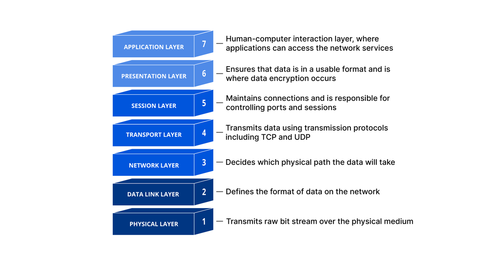

+++
title = "Build your own web-server using Java and a bit of curiosity - Foundation"
date = "2026-08-02"

description = "How a web-server actually works, from the 7 OSI layers down to raw TCP and UDP sockets in plain Java 25, client and server, with no framework involved."


summary = "My journey of building a web-server from scratch, repeating fundamentals and check how to use plain TCP and UDP in Java."

draft = false

showTableOfContents = true

series = ["Why Not A Webserver"]
series_order = 0

tags = [
    "diy",
    "diy-webserver",
    "networking",
    "tcp",
    "udp",
]
categories = [
    "Java"
]
+++
You may wonder why another web server, when there's already [Jetty](https://github.com/jetty/jetty.project), [Tomcat](https://github.com/apache/tomcat), [Netty](https://github.com/netty/netty) etc. 
My answer is [why not](https://github.com/gvart/why-not-webserver)? I'm genuinely bored with the current state of AI engineering, where the only thing you have to do is write another prompt 
to implement another boring ticket, read another paper which was mostly generated by AI, or join some corporate meeting where you start asking yourself existential questions. 
To entertain myself I decided to build a web-server capable of handling traffic via plain TCP and UDP, HTTP and WebSockets with a follow-up Spring Boot Starter and benchmarks (JMH and load tests). 

My final goal is not building a production-grade web-server - my goal is to learn things from A to Z, understand how things work at different levels of abstraction and definitely have some fun!


> [!IMPORTANT] Don't perceive this as a holy grail of web-server building
> This series of blog posts is more of private notes I've taken along the way to understand different topics and better memorize them. I thought other software enthusiasts might be interested in this, that's why
> I decided to share it on my personal blog.

## Why learn the basics?

Many of us know how to build a **static webpage**, **REST-API**, a **GraphQL-API**, realtime **communication via WebSocket** and so on using open source libraries and frameworks like Spring, Ktor, Quarkus etc.
The whole purpose of these top-level abstractions is to simplify your life as a developer, so you don't have to worry about the specs of different protocols and technologies, which helps you to focus on the business logic
and boost your productivity, on the other hand, you start forgetting how things actually work...

Do you really need to know that? In my opinion **no**, since I meet many senior engineers who have no idea what is happening
behind these magic annotations which they use every day to write production code not mentioning the low-level protocols and how data is actually being received by the server and sent back to the client, but this
doesn't make them bad engineers, this knowledge became obsolete in a way, and is not a requirement in many companies to write software.

Taking all this into consideration, why am I still writing? My answer is because **I'm curious**, I've always liked to deep dive into the open source code, debug it and sometimes fork it to modify certain parts which
were specific to my project. So to build our own web-server we must _debug_ the protocol to understand what is happening when you create a server socket, parse the request payload and respond to the client, why we have 7 OSI
levels, why they matter, and finally understand what is happening when you place that magical annotation on top of your method which exposes it as a REST endpoint, a static page or a WebSocket.

If your curiosity is the characteristic that motivated you to do your day-to-day job, then let's dive into this topic and start to learn and craft.


## Back to the roots - OSI Levels and how the connection works
The Open Systems Interconnection (OSI) model defines how computers communicate to each other across networks. To simplify how data is transmitted from computer A to computer B, it is split in 7 canonical layers:

> [!NOTE] You can skip this part and have some fun reading [Networking zine](https://jvns.ca/networking-zine.pdf), personally I found it very entertaining!



I think it's always easier to understand a complex implementation by giving real-world examples, explaining the concepts and defining what is happening at each OSI level.
Let's imagine that you've built a REST API which allows end customers to manage their TODO list. The user is trying to create a new TODO item by invoking your creation endpoint (i.e. `POST: /api/v1/todo`) with 
a payload `{"content": "Buy food for my cat", "dueDate": "12-12-2027"}`, and here are the steps that would happen based on the OSI standard.

### 7. Application layer
This layer is responsible for defining the standards of different top-level protocols like FTP (for file transferring), SMTP (for emailing), HTTP, etc. HTTP is the one which is being used
by our API. So the application code will use HTTP to process the message, at its core HTTP is a simple text-based protocol (true for version 1.1 while HTTP/2 is a binary protocol)

This is what the request will look like at this layer:
```http
POST /api/v1/todo HTTP/1.1
Host: api.example.com
User-Agent: curl/8.7.1
Accept: application/json
Content-Type: application/json
Content-Length: 59

{"content": "Buy food for my cat", "dueDate": "12-12-2027"}
```
That's **214 bytes** of plain text (155 bytes of headers + the empty line, and 59 bytes of body - the same 59 you see in `Content-Length`).
Keep this number in mind, every layer below will wrap it into something bigger.

### 6. Presentation layer
This layer's mission is to translate the request to a format which can be understood by the layer below, it can do things like translation (serialization), compression (gzip), encryption (TLS). 
This is still happening on the client device and is handled by the application code.

In our case this is the step where the TODO object stops being an object and becomes bytes. What your code works with:
```java
new TodoItem("Buy food for my cat", LocalDate.of(2027, 12, 12))
```
And what leaves the process after Jackson serializes it:
```json
{"content": "Buy food for my cat", "dueDate": "12-12-2027"}
```
If the endpoint was served over HTTPS, this is also where TLS would encrypt those 214 bytes, and everything below would only see
random-looking bytes instead of the nice text above.

### 5. Session Layer
The session layer makes sure that the connection between the client and server is established and stays open until data is processed by the server (be it by returning a 
response with payload, simple status code) or until an error occurs.

The closest thing to a "session" in our request is connection reuse. In HTTP/1.1 the connection stays open by default, and clients still send the header explicitly:
```http
Connection: keep-alive
```
Thanks to that, the same TCP connection is reused for the next request (i.e. a `GET /api/v1/todo` to list the TODOs right after creating one),
so you don't pay for a new handshake every time.

> [!NOTE] About layers 5 and 6
> These layers don't really exist any more: in the TCP/IP stack they are part of the application layer, handled by libraries (TLS, gzip, JSON serialization).

### 4. Transport layer
This is where low-level protocols are TCP and UDP (in our case HTTP 1.1/2 is built on top of TCP and HTTP 3 is over UDP), so here the client payload is divided in segments (or datagrams for UDP) and sent to the server (and back), on the server 
side these segments are received and reassembled into data. An additional nice feature of this layer is **ports**, with which you're familiar if you ever bootstrapped a web-app.

Our 214 bytes get a 20 byte TCP header in front of them:
```text
Source port:      54321        <- ephemeral port, picked by your OS
Destination port: 80           <- api.example.com
Sequence number:  1            <- relative, the handshake already consumed 0
Flags:            PSH, ACK
Payload:          214 bytes    <- the whole HTTP request from layer 7
```
Our request is small enough to fit in a **single** segment (a typical Ethernet link allows ~1460 bytes of TCP payload), so there's nothing to split here.
Upload a 5MB picture instead and the same payload would be chopped into thousands of segments, which TCP then has to number, retransmit when lost, and reassemble in order on the other side.

### 3. Network layer
This layer is where IP lives, and its main responsibility is to route the data from computer A to computer B, within a chain of networks.

The segment above is now wrapped into an IP packet:
```text
Version:          IPv4
Source IP:        192.168.1.42   <- your laptop
Destination IP:   192.0.2.10     <- api.example.com, resolved via DNS beforehand
Protocol:         6              <- TCP (17 would mean UDP)
TTL:              64             <- decremented by every router, dropped at 0
Total length:     254 bytes      <- 20 bytes IP header + 234 bytes TCP segment
```
Note that nothing here knows about HTTP, ports or your TODO item, a router only looks at the destination IP and decides where to forward the packet next.

### 2. Data Link layer
This layer is responsible to transmit data between two physically connected nodes by using MAC addresses (physical address of the device). The data chunks are called frames.

The packet is wrapped one last time, into an Ethernet frame:
```text
Destination MAC:  02:1a:2b:3c:4d:5e   <- your router, NOT the server
Source MAC:       02:aa:bb:cc:dd:ee   <- your laptop's network card
EtherType:        0x0800              <- the payload is IPv4
Payload:          254 bytes           <- the IP packet
FCS:              4 bytes             <- checksum, so the receiver can detect corruption
```
This is the detail that surprises most people: the destination MAC is **not** the server's, it's your router's (found via ARP).
MAC addresses only make sense within one physical link, so every hop between you and `api.example.com` strips the frame,
looks at the IP packet inside, and builds a brand new frame with the MACs of the next hop.

### 1. Physical layer
This is the last layer that transmits the data as bits (1 and 0) via wire, fiber or radio. 

Our 272 byte frame finally becomes **2176 bits** (272 * 8) which is transmitted via wire, fiber or a radio signal over Wi-Fi.
No structure left at all, just 1 and 0.


And the exact same process is happening backwards on the server: the network card receives the bits, layer 2 validates the checksum and unwraps the frame,
layer 3 unwraps the IP packet, layer 4 checks the destination port and hands the reassembled 214 bytes to whatever process listens on port `80`,
and only then our web-server sees a text blob starting with `POST /api/v1/todo HTTP/1.1` that it has to parse.
The response (i.e. `201 Created`) then travels down the very same 7 layers on the server and back up on the client.

## How does the connection work?
As stated in [Beej's Guide to Network Programming](https://beej.us/guide/bgnet/html/#what-is-a-socket), a socket is a way of communicating 
with other programs using standard Unix file descriptors. A file descriptor is just an integer that your process uses to refer to an open file (the OS uses it to look up the actual I/O object).
And the nice part is that the "file" behind it can be a network connection. That's why you can read() and write() a socket like any other file.

Enough theory, let's finally touch this `Socket` and try to write and read from it.

> [!NOTE] Why bother with sockets?
> Sockets are what every web-server uses under the hood, Jetty and Netty included. That's why it's worth understanding how they behave at the lowest level before we build anything on top of them.

> [!IMPORTANT] All examples use Java 25
> A `void main()` without `String[] args` and the `IO.println` helper come from [compact source files and instance main methods](https://openjdk.org/jeps/512), finalized in Java 25. On an older JDK, use a regular `public static void main(String[] args)` and `System.out.println` instead, everything else stays the same.

## TCP
Let's start with the client, since it's the easier half. To have something to talk to we'll use `netcat` (`nc`), the utility used for just about anything under the sun involving TCP or UDP, as a simple server.

### Writing to a socket
The main abstraction to work with sockets in Java is 🥁🥁🥁 ta-dam `java.net.Socket`. In the following example we create a socket that connects to `localhost:6666` and sends a message.
```java
void main() throws IOException {
    //Instantiate a new socket! The constructor performs the TCP handshake,
    //so once it returns the connection is already established.
    var socket = new Socket("localhost", 6666);
    IO.println("Local port:" + socket.getLocalPort() + ", Remote port:" + socket.getPort());

    //Wrap the output stream in a PrintWriter so we can easily operate with plain Strings.
    var writer = new PrintWriter(socket.getOutputStream(), true);
    writer.println("Hello from low-level world!");
}
```

Start the listener first, otherwise the client has nothing to connect to and fails with `Connection refused`:
```shell
nc -l 6666
```

Then run the Java program, and you'll see that `netcat` received your message and printed it.
```text
➜ nc -l 6666
Hello from low-level world!
```

In the Java program you'll also see that a random port was assigned on the client side.
```text
➜ Local port:58530, Remote port:6666
```
That's the **ephemeral port**, picked by your OS. Together with the source IP, destination IP and destination port it forms a unique identifier for this connection.

### Reading from a socket
So what happened just now? You opened a TCP connection and pushed a message to the "server". To make it more fun, let's extend the client so it can also receive messages, using the `InputStream` that `Socket` exposes.
```java
void main() throws IOException {
    try (var socket = new Socket("localhost", 6666)) {
        IO.println("Local port:" + socket.getLocalPort() + ", Remote port:" + socket.getPort());

        var writer = new PrintWriter(socket.getOutputStream(), true);
        writer.println("Hello from low-level world!");

        //Wrap the input stream into an InputStreamReader which turns bytes into characters,
        //then wrap it again in a BufferedReader so we can read whole lines
        var reader = new BufferedReader(new InputStreamReader(socket.getInputStream()));

        String line;
        //readLine() blocks until a full line arrives, and returns null
        //only when the other side closes the connection
        while ((line = reader.readLine()) != null) {
            IO.println(line);
        }
    }
}
```

`netcat` can send messages back too! Start `nc -l 6666`, then the Java program, and now anything you type into the netcat session followed by ENTER shows up in your client.

> [!NOTE] TCP is a stream of bytes, not a stream of messages
> TCP guarantees that the bytes you wrote arrive, in order, without duplicates. It guarantees nothing about where one message ends and the next begins, there are no message boundaries on the wire. Our `readLine()` works only because both sides silently agreed that `\n` terminates a message. Every protocol built on top of TCP has to define this **framing** itself: HTTP/1.1 does it with `Content-Length`, and we'll have to do exactly the same once we start parsing real requests.

### Building our own server
Since we are Java developers, let's get rid of external tools and build our own server. Trust me, it's easier than you think: it's basically the same as working with a socket, except you start from `java.net.ServerSocket`. A `ServerSocket` doesn't transfer any data itself, it only listens on a port and hands you a brand new `Socket` for every accepted connection via `ServerSocket#accept`. Everything after that is identical to the client code.
```java
void main() throws IOException {
    var server = new ServerSocket(6666);

    //At this point the application is blocked until a connection request is made by a client.
    //Every accepted connection gets its own Socket, with its own pair of streams.
    var socket = server.accept();
    IO.println("Connection accepted, local port:" + server.getLocalPort());

    var writer = new PrintWriter(socket.getOutputStream(), true);
    var reader = new BufferedReader(new InputStreamReader(socket.getInputStream()));

    String line;
    while ((line = reader.readLine()) != null) {
        IO.println(line);
        //Send a message back to the client
        writer.println("Hi from the server!");
    }
}
```

And that's it, start both the server and the client and they'll exchange messages, no `netcat` involved.

### Accepting more than one connection
Keep in mind that our server handles exactly one client. `accept()` is a blocking call, and we call it once, so the second client to connect just waits in the OS backlog queue until the first one is done. 
To serve many clients, we can accept in a loop and handle in background by using threads! 
```java
void main() throws IOException {
    var server = new ServerSocket(6666);
    var executor = Executors.newVirtualThreadPerTaskExecutor();

    //Keep accepting connections forever, each one handled on its own virtual thread
    while (true) {
        var socket = server.accept();
        executor.submit(() -> handleConnection(socket));
    }
}

void handleConnection(Socket socket) {
    //handle the same way we did before.
}
```
The accept loop now does nothing but hand sockets over, and the blocking reads happen on virtual threads, which cost a few hundred bytes each instead of a full OS thread stack.

## UDP
OK, since you're now an expert in TCP connections, let's move on to UDP. The first thing to know is that UDP is often called **connectionless** communication, because it never keeps a connection open the way TCP does.
There's no handshake, nothing to establish and nothing to stop, you just build a [datagram](https://en.wikipedia.org/wiki/User_Datagram_Protocol) and send it to an address.
A datagram is nothing more than your payload plus an 8 byte header (source port, destination port, length, checksum).

UDP is fire and forget: there's no guarantee that a datagram reaches the server, no guarantee about the order in which datagrams arrive, and no retransmission when one is lost.
That's why UDP fits data that can afford to be lost or arrive out of order (live video, voice, metrics, game state), and why anything that does need those guarantees has to rebuild them on top.
A good example is [TFTP](https://en.wikipedia.org/wiki/Trivial_File_Transfer_Protocol), which runs over UDP but adds its own acknowledgement mechanism so that every block is confirmed before the next one is sent.

### Sending and receiving datagrams
Enough theory, let's build a client that sends a datagram, with `netcat` again as a server. This time the abstractions are `java.net.DatagramSocket` (the endpoint) and `java.net.DatagramPacket` (the datagram itself).

```java
void main() throws IOException {
    //Bind to a fixed source port (1234) so netcat keeps talking to us between re-runs.
    //`nc -u -l` locks onto the first peer it hears from, so with a random ephemeral port
    //every restart of the client would require a restart of netcat too.
    var socket = new DatagramSocket(1234);
    var serverAddress = new InetSocketAddress(InetAddress.getLoopbackAddress(), 7777);

    var message = "Hello from low-level world, now from UDP!".getBytes(StandardCharsets.UTF_8);

    //Wrap the bytes into a datagram addressed to localhost:7777 and send it.
    //There's no connection here, send() returns as soon as the OS accepted the datagram.
    socket.send(new DatagramPacket(message, message.length, serverAddress));

    //To receive anything back we must use receive(). Normally the protocol you build
    //on top of UDP defines the maximum datagram size, since we have no idea how
    //much text you'll type into netcat let's take an arbitrary 1KB. Anything above that is silently dropped.
    var response = new DatagramPacket(new byte[1024], 1024);
    socket.receive(response);
    var responseMessage = new String(response.getData(), response.getOffset(), response.getLength(), StandardCharsets.UTF_8);

    IO.println(responseMessage);
}
```

Don't forget to start the `netcat` listener, otherwise nobody will ever receive your datagram `:(`
```shell
nc -u -l 7777
```

Then run the Java program, and you'll see that `netcat` received your message and printed it.
```text
➜ nc -u -l 7777
Hello from low-level world, now from UDP!
```

From that same terminal session you can send a message back to the client, just type anything like `Salut UDP protocol!` and press ENTER, and it will show up in the output of the Java process.

### Building our own server
We do love Java, so let's drop `netcat` and write our own UDP server. It's pretty much what we just did on the client, with one difference: there's no `ServerSocket` equivalent and nothing to accept, 
a single `DatagramSocket` bound to a port serves every client that sends to it.
```java
int PACKET_SIZE = 1024;

void main() throws IOException {
    var socket = new DatagramSocket(7777);

    //Stay in an infinite loop to receive all incoming datagrams
    while (true) {
        var request = new DatagramPacket(new byte[PACKET_SIZE], PACKET_SIZE);
        socket.receive(request);
        var requestMessage =
                new String(
                        request.getData(),
                        request.getOffset(),
                        request.getLength(),
                        StandardCharsets.UTF_8);
        IO.println(requestMessage);

        var responseMessage = "Hi from the server!".getBytes(StandardCharsets.UTF_8);

        //Build a new datagram and send it back to whoever wrote to us, the received
        //packet carries the sender's address, which is the only thing connecting the two sides together.
        socket.send(new DatagramPacket(responseMessage, responseMessage.length, request.getSocketAddress()));
    }
}
```

And that's it, start both the server and the client and they'll exchange messages, no `netcat` involved.
Note that a single socket already handles many clients here, since each datagram carries its own return address, so there's no per-connection state to keep, that's exactly what makes UDP servers cheap.
For now this is enough to get familiar with the basic UDP workflow in Java, we'll go deeper in the upcoming posts where we try to implement HTTP/3 for our web-server!

## Outcome
Now that you know how to work with TCP and UDP, feel free to experiment and build something yourself, or check out the chat application [I've built](https://github.com/gvart/why-not-webserver/tree/why-not-webserver-part-0#tcp-chat)
and the [UDP metric collector](https://github.com/gvart/why-not-webserver/tree/why-not-webserver-part-0#udp-metrics), both using the concepts shared above.
You could also try rebuilding one of the existing protocols that run on top of TCP or UDP, or who knows, you may end up designing your own protocol with custom specs!

In the next blog post I'll establish a basic web-server which is capable of receiving requests, processing them and returning the response to the client over TCP, UDP and HTTP!

## Reference links
* [GitHub link](https://github.com/gvart/why-not-webserver/tree/why-not-webserver-part-0)
* [What is the OSI Model?](https://www.cloudflare.com/learning/ddos/glossary/open-systems-interconnection-model-osi/)
* [What happen when](https://github.com/alex/what-happens-when)
* [Beej's Guide to Network Programming](https://beej.us/guide/bgnet/html/)
* [Networking zine](https://jvns.ca/networking-zine.pdf)
* [A Guide to Java Sockets](https://www.baeldung.com/a-guide-to-java-sockets)
